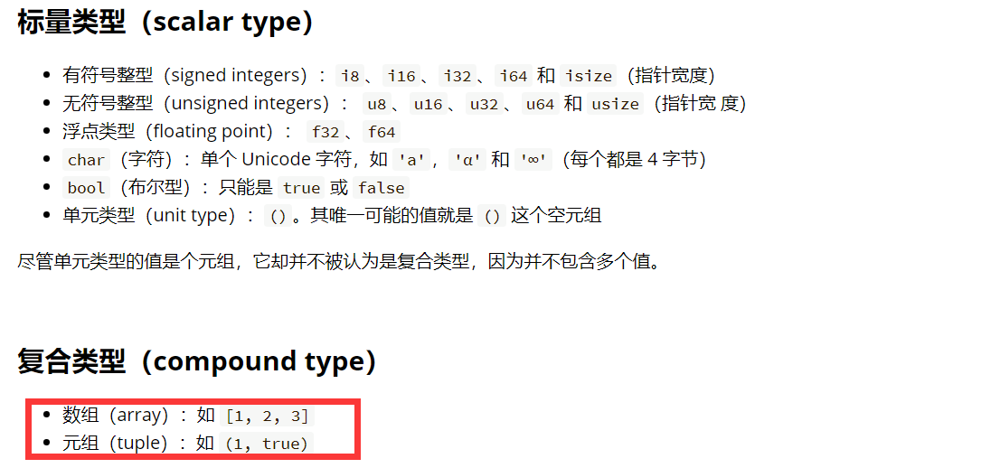

### 1 hello world
1.1 注释：略
***
1.2 格式化输出：略
***
1.2.1 调试debug


***
1.2.2 显示display

对于任何非泛型的容器类型，fmt::Display都能够实现。

大概可以理解为只要添加了#[derive(Debug)]，打印时就会自动实现。而display需要手动实现trait，指定具体怎么实现。
```
use std::fmt;
fn main() {
    let complex = Complex {
        real: 3.3,
        imag: 7.2,
    };
    println!("Display: {}", complex);
    println!("Debug: {:?}", complex);
}

#[derive(Debug)]
struct Complex {
    real: f64,
    imag: f64,
}

impl fmt::Display for Complex {
    fn fmt(&self, f: &mut fmt::Formatter) -> fmt::Result {
        write!(f, "{} + {}i", self.real, self.imag)
    }
}
```
***
1.2.3

这里不太明白，cqcq。

```
 write!(f, "{}", v)?; => write!(f, "{}: {}",count, v)?;
```

***  
### 2 原生类型


？？？复合类型只有这两种，struct不算？

2.1 字面量和运算符，略略略

2.2 元组

