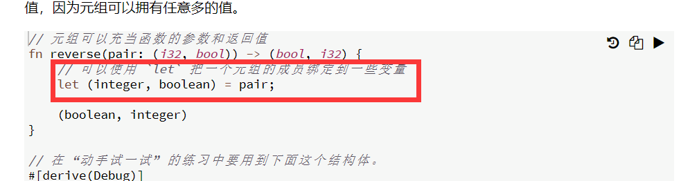

### 2 原生类型

cqcq 复合类型只有这两种，struct不算？

***

2.1 字面量和运算符，略略略
***

2.2 元组

其它文档查到的资料：元组和数组声明后都不能改变长度。元组元素的类型可以不一样，数组则必须相同。 zdzd


ssss 不明白意义
```1
//第一题
use std::fmt;
#[derive(Debug)]
struct Matrix(f32, f32, f32, f32);

impl fmt::Display for Matrix {
    fn fmt(&self, f: &mut fmt::Formatter) -> fmt::Result {
        write!(f, "( {} {} )\n( {} {} )", self.0, self.1, self.2, self.3)  //mark
    }
}

fn main() {
    let matrix = Matrix(1.1, 1.2, 2.1, 2.2);
    println!("{}", matrix)
}
//注意换行符是\n而不是/n
```
```
//2
use std::{array, fmt};
fn transpose(xmatrix: Matrix) -> Matrix {
    Matrix(xmatrix.0, xmatrix.2, xmatrix.1, xmatrix.3)
}

#[derive(Debug)]
struct Matrix(f32, f32, f32, f32);

impl fmt::Display for Matrix {
    fn fmt(&self, f: &mut fmt::Formatter) -> fmt::Result {
        write!(f, "( {} {} )\n( {} {} )", self.0, self.1, self.2, self.3)
    }
}

fn main() {
    let matrix = Matrix(1.1, 1.2, 2.1, 2.2);
    println!("Matrix:\n{}", matrix);
    println!("Transpose:\n{}", transpose(matrix));
}
//这里没有使用array，以后可以试试使用。ssss
```


