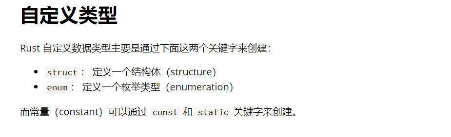
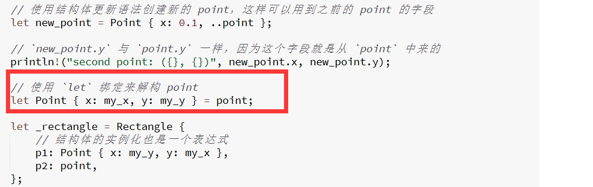

3.自定义类型  

***
3.1结构体

```
//1
#[derive(Debug)]
struct Cfx {
    chang:i32,
    kuan:i32,
}

fn rect_area (xcfx:Cfx)->i32{
    xcfx.chang*xcfx.kuan
}

fn main(){
    let cfx = Cfx{
        chang:20,
        kuan:10,
    };
    println!("the area is {} square meter",rect_area(cfx));
}
```

```
//2 略
```
