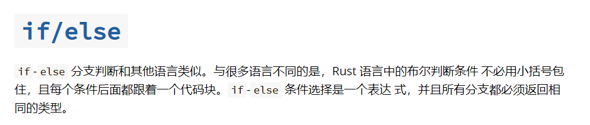
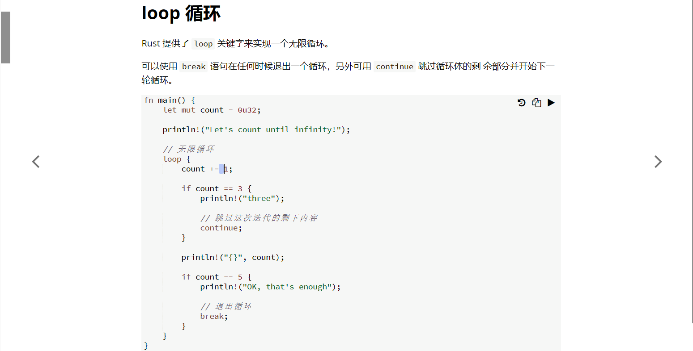
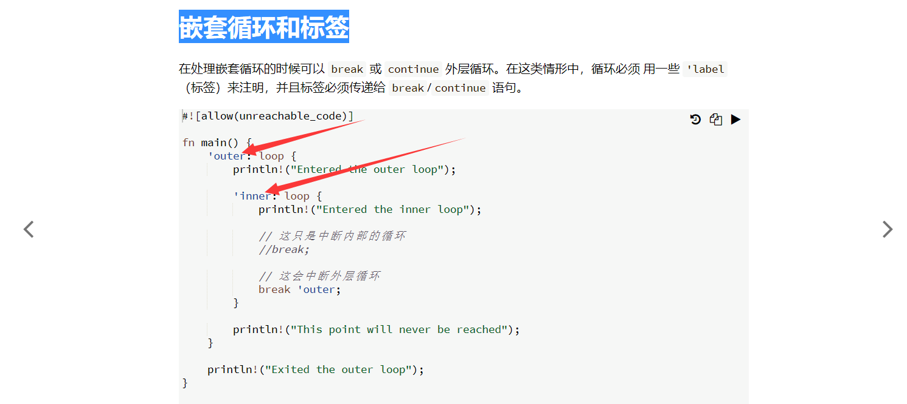
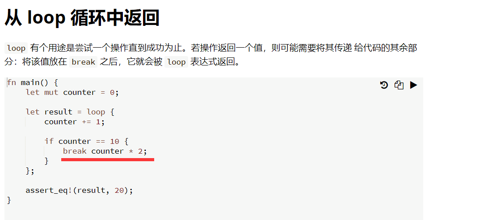
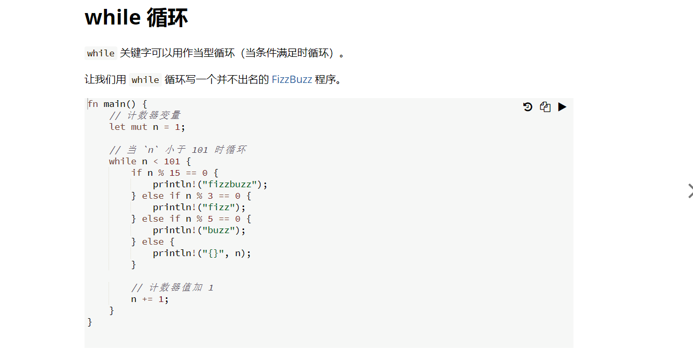
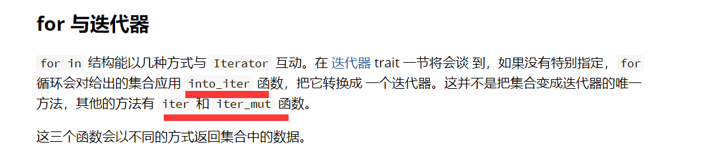

8 流程控制

8.1 if/else

***
8.2 loop循环

***
8.2.1 嵌套循环和标签

cccc 暂不理解一些部分
***
8.2.2 从 loop 循环中返回

最终返回值是20而不是10。
***
8.3 while循环

***
8.4 for循环和区间  

for 与区间  
llll

for 与迭代器

zzzz:into_iter iter 和 iter_mut 3个不同迭代函数的区别。截图太长，直接看原文：https://rustwiki.org/zh-CN/rust-by-example/flow_control/for.html#for-%E4%B8%8E%E8%BF%AD%E4%BB%A3%E5%99%A8  

