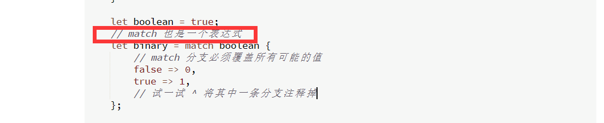
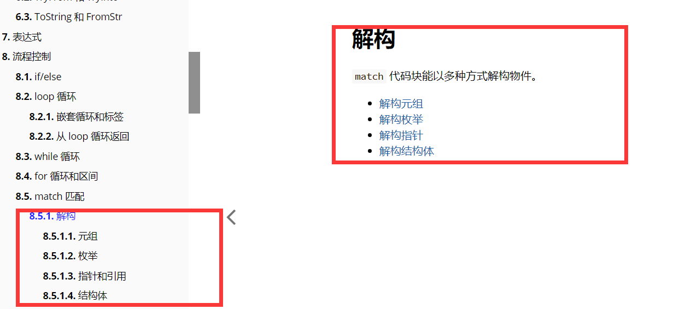
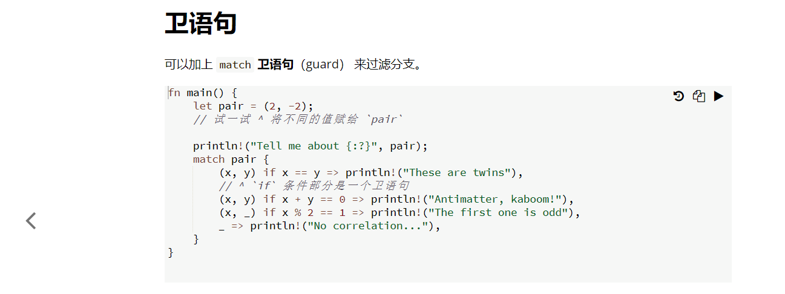
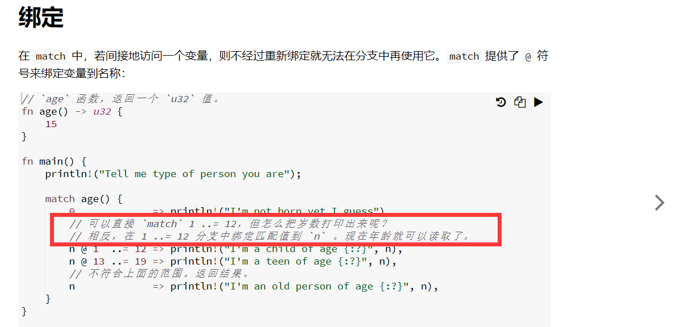
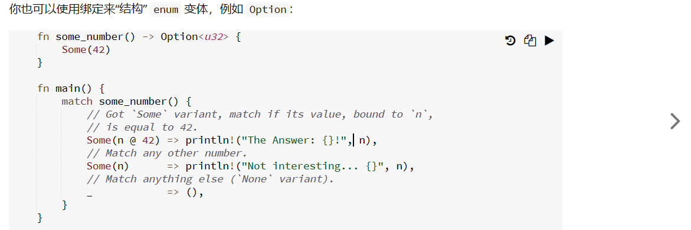
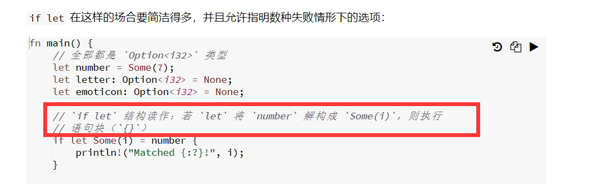
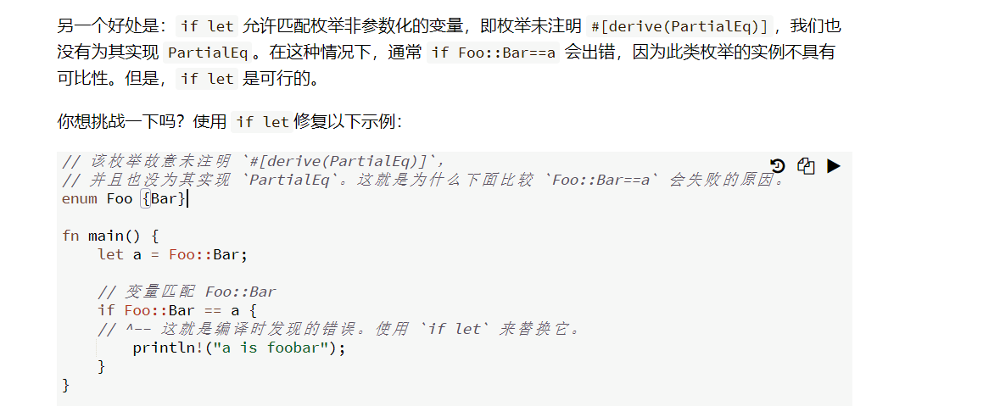
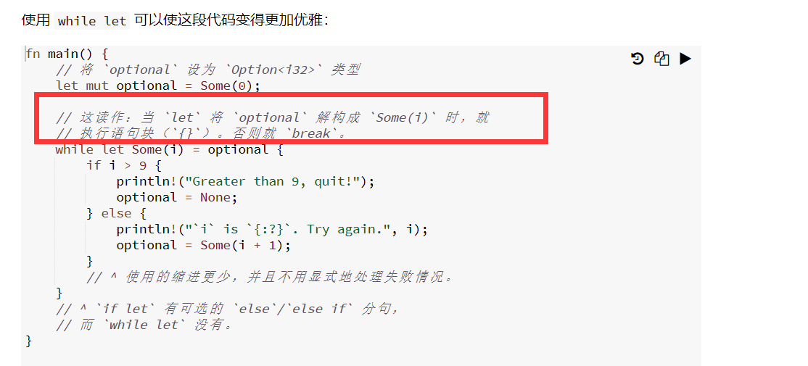

8 流程控制

8.1 if/else

***
8.2 loop循环

***
8.2.1 嵌套循环和标签

cccc 暂不理解一些部分
***
8.2.2 从 loop 循环中返回

最终返回值是20而不是10。
***
8.3 while循环

***
8.4 for循环和区间  

for 与区间  
llll

for 与迭代器

zzzz:into_iter iter 和 iter_mut 3个不同迭代函数的区别。截图太长，直接看原文：https://rustwiki.org/zh-CN/rust-by-example/flow_control/for.html#for-%E4%B8%8E%E8%BF%AD%E4%BB%A3%E5%99%A8  
***
8.5 match 匹配      

dddd 这里说match是表达式，但表达式应该返回值且不接分号。所以有疑问

8.5.1 解构

zzzz：内容较多，不再一一截图，直接看网页 https://rustwiki.org/zh-CN/rust-by-example/flow_control/match/destructuring.html  
其中8.5.1.3没搞懂。
***
8.5.2 卫语句    

相当于是match里再接个判断，然后给出结果。
***
8.5.3 绑定

***
8.6 if let

大致意思是如果number 符合 some(i)，则执行大括号里的语句。

cccc:这段没搞懂，以后再研究。
***
8.7 while let

***
